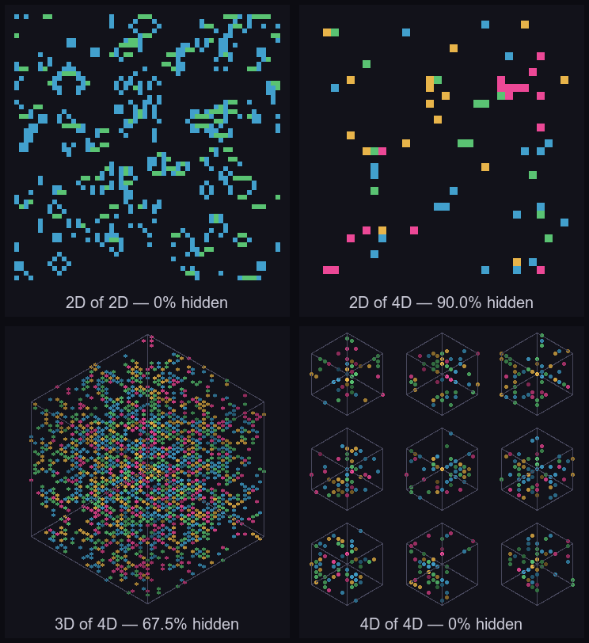

# bqn-brane-of-life

An n-dimensional Game of Life in BQN, shown as a **3D brane sliced from a 4D
automaton**. You watch a 3D volume evolve. About **67.5%** of what drives it
lives in a 4th dimension you can't see, so cells are born and die with no
visible cause.

> More affected by the invisible than the visible.


*A 32³ brane sliced at `w=0` from a 4D `S4/B4` automaton, one seed over 96
generations. Each voxel is coloured by the axis most of its neighbours lie
along — blue/green/amber for the visible x/y/z, **magenta for the hidden `w`**.
Every birth and death you see is 32.5% local and 67.5% driven by neighbours on
that magenta axis you can't see.*

## The idea in one number

A cell's fate depends on its Moore neighbourhood of `3^d − 1` cells. Render only
a k-dimensional slice and the neighbours along the `d − k` hidden axes are
invisible. The share of each cell's fate you cannot account for is:

```
invisible_fraction = (3^d − 3^k) / (3^d − 1)
```

For the flagship (k=3 visible, d=4): `(81 − 27) / (81 − 1) = 54/80 =` **67.5%**.

| d | Moore neighbours | invisible for a 3D slice |
|---|---|---|
| 3 | 26  | 0% (nothing hidden) |
| 4 | 80  | **67.5%** ← flagship |
| 5 | 242 | 89.3% |

The engine is dimension-agnostic, so both numbers are parameters, not rewrites.

## Any dimension into any dimension

Pass `k` (the visible dimension) and `d` (the automaton's dimension), with
`1 ≤ k ≤ 4` and `k ≤ d`. The renderer draws a 1D line, a 2D grid, a 3D iso cube,
or — for 4D — a grid of iso cubes (one per the 4th visible axis). Every cell is
coloured by the axis most of its neighbours lie along, so a magenta cell is one
driven mainly from off-slice.



```sh
bqn brane.bqn k=2 d=2      # classic flat Life,        0% hidden
bqn brane.bqn k=2 d=4      # 2D slice of 4D,        90.0% hidden
bqn brane.bqn k=3 d=4      # the flagship cube,     67.5% hidden
bqn brane.bqn k=4 d=4 n=10 # 4D as small multiples,    0% hidden
bqn brane.bqn k=1 d=3      # a single line,         92.3% hidden
```

`invisible = (3^d − 3^k)/(3^d − 1)`, printed on every run.

## Why BQN

A neighbour count is the board summed over every shift. In an array language
that generalises across rank for free: the same `Step` runs at d=2, 3, 4, 5 with
dimension read off the grid's rank, not hard-coded. The neighbour sum is
**separable** (a 3-wide sum along each axis, composed over all axes) so d=4 costs
~12 shift-adds instead of the 81 you'd get from building every shifted copy.

```bqn
Box  ← {d←=𝕩 ⋄ F←{𝕤⋄a←𝕨⋄g←𝕩⋄v←1⌾(a⊸⊑)(d⥊0)⋄(v⌽g)+g+(-v)⌽g} ⋄ 𝕩 F´ ↕d}
Neigh ← {(Box 𝕩)-𝕩}
Life ← {s‿b←𝕨 ⋄ n←Neigh 𝕩 ⋄ (n∊b)∨𝕩∧n∊s}   # 𝕨 = ⟨survive, birth⟩, Bays S/B
```

Boundaries wrap (toroidal) on every axis, the hidden one included.

## Run it

Needs [CBQN](https://github.com/dzaima/CBQN) (`bqn` on PATH) and `ffmpeg`.

```sh
make test     # engine correctness gate — Conway patterns at d=2, rank check at d=3/4
make hero     # render the flagship loop → assets/hero.gif + out/brane.mp4
make search   # hunt for living 4D rules → rules.md
make clean
```

Drive the engine directly for any dimension, rule, or seed:

```sh
bqn brane.bqn k=3 d=4 n=32 rule=S4/B4 seed=42 steps=200 px=800 out=frames
```

Rules use Bays survive/birth notation with ranges: `S4/B4`, `S3-6/B3`,
`S5-8/B9-10`.

## Design decisions

- **Rule.** Conway's B3/S23 dies instantly in 4D (80 neighbours, not 8). `make
  search` scores random interval rules on one seed for survival, low density,
  and churn, and writes a leaderboard to [`rules.md`](rules.md). The flagship is
  **`S4/B4`**: it holds a steady ~8% brane density with heavy turnover, so the
  cube stays translucent and never strobes (the `B3` family flickers with a
  period-2 parity beat).
- **Seeding.** The seed is a slab of noise offset into the hidden `w` layers, not
  centred on the visible slice. Activity drifts *into* the `w=0` brane from
  off-slice, which is what makes births look uncaused. Tunable via `wc`/`wh`.
- **Render.** Full BQN, fixed isometric view, no camera. Each live voxel is
  splatted as a hexagon back-to-front (painter's algorithm, done as a vectorised
  z-buffer). Hue is the voxel's **dominant neighbour axis** — the axis whose two
  ±1 hyperplanes hold the most live neighbours, computed in full 4D so a magenta
  voxel is literally one driven from off-slice. Depth modulates brightness (near
  bright, far dim) so 3D still reads, and an always-drawn bounding-box wireframe
  gives the eye a stage. BQN emits PPM frames; `ffmpeg` assembles the loop. No
  orbit on purpose — being able to rotate the volume would let you account for
  every birth, which fights the whole point.

## Layout

| file | role |
|---|---|
| `life.bqn`   | dimension-agnostic engine (`Box`, `Neigh`, `Life`, `Run`, `Trajectory`, `AxisDom`) |
| `seed.bqn`   | 4D initial conditions (`Noise`, hidden-layer `Slab`) |
| `search.bqn` | rule search → `rules.md` |
| `render.bqn` | k-D brane → RGB raster (line / grid / iso cube / small multiples) |
| `ppm.bqn`    | PPM (P6) writer |
| `brane.bqn`  | main: evolve, slice `w=0`, render frames |
| `test/`      | Conway correctness gate |
| `plan.md` · `SPEC.md` | the plan and the original brief |

## References

- Carter Bays — higher-dimensional Life rules and their survive/birth notation.
- [`dlozeve/bqn-graphics`](https://github.com/dlozeve/bqn-graphics) — the render
  reference (BQN array → PNM, colormaps). This repo emits PPM directly instead.
- [BQN](https://mlochbaum.github.io/BQN/) · CBQN. Media-pipeline idioms follow my
  own [BQNoise](https://github.com/4esv/BQNoise).
